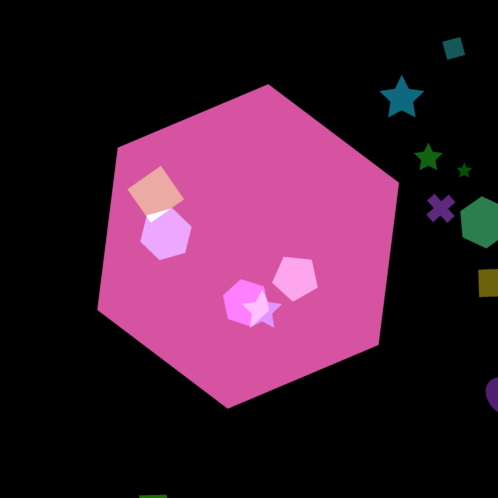
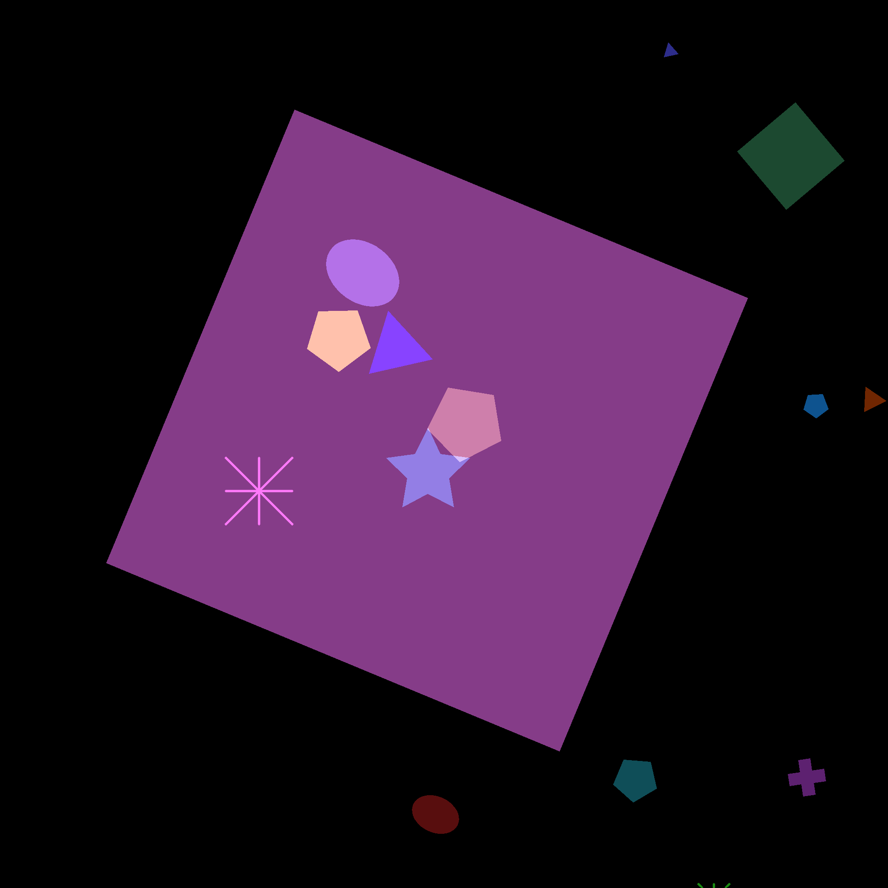
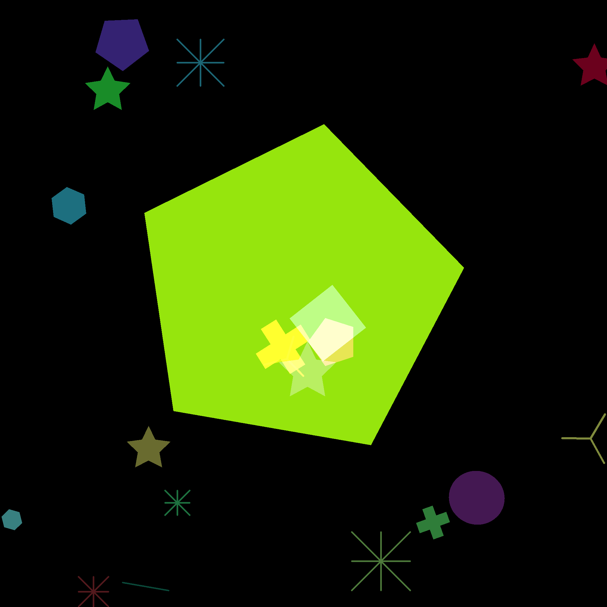
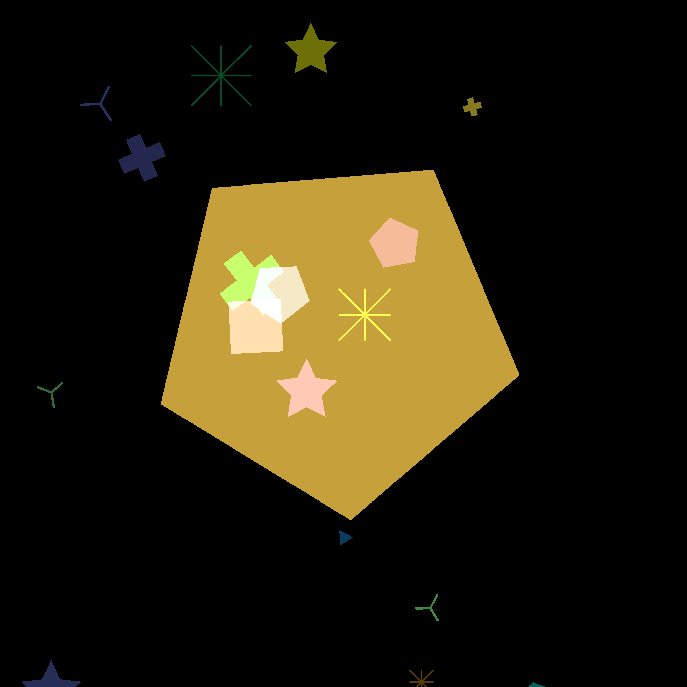

# Simple Concept DataBase

SCDB is a synthetic dataset developed for concept localization and inspired by the challenges of skin lesion classification using dermatoscopic images. It mimics the complex composition of diagnostic criteria in skin lesions e.g. spatial overlap, providing concept annotations and concept segmentation masks.

Download SCDB [here](https://cloud.dfki.de/owncloud/index.php/s/NM6wLXPnCD8CeGw).

If you use this dataset, please consider citing our associated [paper](#):
```
    @article{lucieri2020explaining,
        title={Explaining AI-based Decision Support Systems using Concept Localization Maps},
        author={Lucieri, Adriano and Bajwa, Muhammad Naseer and Dengel, Andreas and Ahmed, Sheraz},
        journal={arXiv preprint arXiv:},
        year={2020}
    }
```

<p align="center">
  
   
  
  
</p>

## Dataset Description
Skin lesions are represented as big geometric base shapes filled with concepts, that are represented as smaller geometries that are randomly coloured, shaped and oriented. 10 shapes representing single concepts are used:

+ Cross
+ Ellipse
+ Hexagon
+ Line
+ Pentagon
+ Rectangle
+ Star
+ Starmarker
+ Triangle
+ Tripod

Concepts relevant to the target classifciation task occure only within the area of the base shape. 8 out of 10 concept classes are relevant for classifciation. Two concept classes (Cross, Line) are non-correlated to target classes. Target classes are indicated by following concept combinations:

Target Class| Indicative Concept Combinations
---|:-:
C1|Hexagon&Star, <br>Ellipse&Star, <br>Triangle&Ellipse&Starmarker
C2|Pentagon&Tripod, <br>Star&Tripod, <br>Rectangle&Star&Starmarker

## Dataset Files
For each dataset split, label annotations (csv) as well as concept annotations (npy) are available. A separate concept split can be used for CAV training.

Split|Datafile|Annotations|Samples
---|---|---|:-:
Train|train.csv|train.npy|4800
Validation|val.csv|val.npy|1200
Test|test.csv|test.npy|1500
Concept|concept.csv|concept.npy|6000

